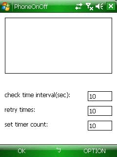

- ## windows-mobile-phone-radio-enable-disable-stress-test
	- A Windows Mobile program for phone radio enable and disable stress test.
- ### :crossed_swords:Functions
	- Set the time interval between each phone radio on and off action.
	- Set the number of retries if the phone radio cannot be turned off.
	- Set the number of tests.
- ### :film_projector:Demo
  
- ### ⏲️HISTORY
	- Version 1.00 - Date 2008/4/7
		- Set the time interval between each phone radio on and off action.
	- Version 1.10 - Date 2008/4/8
		- Set the number of retries if the phone radio cannot be turned off.
		- Set the number of tests (set timer count).
- ### :sparkling_heart: Buy me a coffee 
  If the utility solves your problem, you can buy me a coffee via [this link](https://www.buymeacoffee.com/zhihau).
- ### License
  MIT
